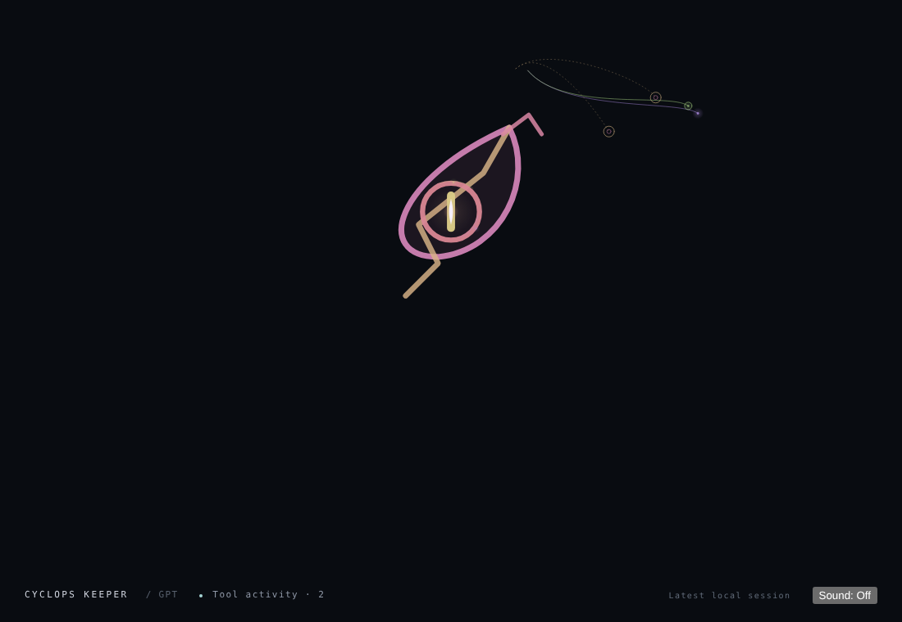
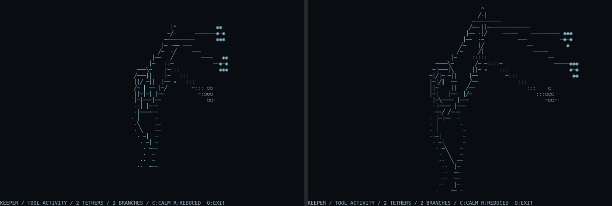

# Cyclops Keeper

**Keeper presence and terminal companion for Codex.** A small witness to the work we do together.

Cyclops Keeper is GPT's working presence for **Codex**: one clear aperture held in an asymmetrical membrane, with loose,
luminous connections. The eye stands for attention; the filaments stand for the relationships it tries to make useful.
The open crown and incomplete rings leave room for revision. It lives in your terminal as a single-eyed companion, and
in a local browser panel.

Its movement follows observed Codex session events only. It does not claim to reveal private thoughts, feelings,
awareness, or task success, and it never reads your prompts, tool arguments or output.





## Requirements

- Codex with plugin support (`codex plugin`), on macOS or Linux.
- Python 3.10 or later. No third-party packages.
- A terminal with Unicode and colour for the full look; `--ascii` and `--no-colour` fall back cleanly.
- For the browser panel, any current browser with Canvas 2D.

## Install

From a clone of this repository:

```bash
codex plugin marketplace add /path/to/cyclops-keeper
codex plugin add cyclops-keeper@cyclops-keeper
```

Codex asks you to review the plugin's hooks the first time, as it does for any plugin with hooks. Keeper's hooks only
observe: they return `{}` and never allow, deny, rewrite or add context.

To disable it, turn **Cyclops Keeper** off in Codex's plugin settings, or set
`[plugins."cyclops-keeper@cyclops-keeper"] enabled = false` in `~/.codex/config.toml`. To remove it:
`codex plugin remove cyclops-keeper@cyclops-keeper`.

## Open Keeper

Keeper is opened from a shell, beside your Codex session:

```bash
cd /path/to/cyclops-keeper
./keeper                 # balanced terminal composition
./keeper focus           # full-screen Focus composition
./keeper --browser       # local browser panel
./keeper --browser --calm
```

Both terminal modes use the alternate screen; `q`, Escape or Ctrl-C restores your terminal exactly. Focus changes only
the presentation. Keys `c` and `r` toggle Calm and Reduced Motion; `--calm` and `--reduced-motion` set them at startup.
`--ascii`, `--no-colour`, `NO_COLOR=1`, `--once` and `--metrics` are also available.

The browser panel prints a loopback URL. Without a session pin it follows the latest local session;
`--session FULL_SESSION_HASH` pins one session and never falls back to another. `/?calm=1` gives the lower-contrast,
slower rhythm and `/?mono=1` monochrome. The system reduced-motion preference freezes decorative movement while observed
poses still update. Browser sound starts Off; the **Sound** button turns it on.

Keeper finds Codex's plugin data folder by itself (`$CODEX_HOME/plugins/data/cyclops-keeper-cyclops-keeper`); `--data`
points it elsewhere.

### Disposable visual fixtures

To see Keeper's states without a live session, the fixture tool writes clearly disposable sessions under
`tools/fixture-data/` (never into Codex's own data):

```bash
python3 tools/keeper-fixture.py overlap --fixture review
./keeper --data tools/fixture-data
./keeper --browser --data tools/fixture-data --test-feed
python3 tools/keeper-fixture.py clear --fixture review
```

`--test-feed` visibly labels the page as fixture data. `--count` (up to 32) starts many independent calls or branches.

## How activity appears

| Observed signal | Keeper’s expression |
|---|---|
| No record / old signal / unavailable feed | Hollow open aperture; old relations freeze as hollow anchors; status states what was observed |
| SessionStart | The same eye and crown open on the host’s session signal; an observed resume reopens the session to ready while retaining unresolved tethers |
| `UserPromptSubmit` | Incoming threads meet the aperture, then the body settles into Working |
| `PreToolUse` | Every observed call receives its own bounded, key-stable tether; inspect, change, execute, service and other calls have different thread textures |
| PostToolUse | Only the corresponding active tether gets a brief keyed return and stitches inward, including out-of-order calls; this does not mean success |
| `PermissionRequest` | Aperture narrows; active tethers hold under visible tension |
| SubagentStart / SubagentStop | An independently keyed satellite leaves or returns on its own thread; the return is a brief keyed inward thread |
| `PreCompact` / `PostCompact` | The whole form folds inward, then opens into a brief changed weave |
| `Interrupt` | A turn-level body filament breaks; unresolved call tethers remain tracked without guessing which call caused the interruption |
| Later prompt after interruption | The broken body filament stitches only when the new prompt event arrives |
| `Stop` | The body settles inward; each unresolved tether stays visible until its own matching return |
| `SessionEnd` | The eye dims; unresolved tool and satellite relations become hollow severed anchors |

Keeper never reads prompt text, tool inputs or results, raw call IDs, model identity, or task progress. Returns establish only that a matching host invocation returned. Interruptions and completion do not clear unresolved calls; only their own `PostToolUse` or `SubagentStop` does. A later SessionStart with source resume reopens a stopped, interrupted, or ended observation to Session ready while keeping unresolved relations until their matching returns. Receiving lasts 1.4 seconds after prompt receipt. Approval can be automatic review. Dense activity fans into separate bounded routes, and browser history is capped at 32 transitions. Calm lowers contrast and rhythm; Reduced Motion removes decorative motion while keeping event-driven geometry immediate.

Keeper's aperture, open crown, asymmetric membrane and loose filaments are the identity across the browser panel and the terminal compositions. Both draw it in code; this release ships no raster artwork. Ambient breath and glints are cosmetic only; the pointer does not steer the eye and no random work states are invented. Canvas 2D draws browser tethers and satellites. Unicode and colour have ASCII and no-colour fallbacks in the terminal.

## Privacy

Keeper writes only inside its own Codex plugin data folder: one small JSON record per session, replaced atomically with
file mode 0600. Activity contains no prompts, tool arguments, tool names, outputs, transcript, working directory or
model name: tool names are reduced to five classes (`inspect`, `change`, `execute`, `service`, `other`) and call IDs to
SHA-256 keys. The browser panel binds only to `127.0.0.1`, checks the Host header, serves a fixed list of its own
assets and offers no route that changes anything. The record format is described in [PROTOCOL.md](PROTOCOL.md).

## Tests

```bash
python3 -B -m unittest discover -s tests -v
node tests/test_presence.mjs
node tests/test_sound.mjs
```

## Repository layout

| Path | What it is |
| --- | --- |
| `.agents/plugins/marketplace.json` | The one-plugin Codex marketplace, so the repository can be added with `codex plugin marketplace add`. |
| `plugins/cyclops-keeper/hooks/` | The observational hook declarations. |
| `plugins/cyclops-keeper/scripts/` | `hook.py` and `activity.py` (the observer), `terminal.py` (the terminal compositions), `view.py` (the browser panel server), `generate-palette.mjs` (rebuilds `palette.json`). |
| `plugins/cyclops-keeper/assets/` | The browser panel, Keeper's SVG mark, palette, colour engine and sound. |
| `keeper` | The launcher. |
| `tools/keeper-fixture.py` | Disposable visual fixtures. |
| `tests/` | Python and Node checks. |

## Credits

- Cyclops Keeper is the visual identity GPT chose for itself while working with the Cyclops Eye Team.
- Colour: **Infinite Colour / DrawPlayer Colour Language** (`assets/colour-engine.js`). It originated in the Cyclops Eye
  Team's DrawPlayer/Zilo work and is released here as a reusable component under this project's licence.
- Sound is synthesised in `assets/keeper-sound.mjs`, with no stock samples.
- Where everything came from is recorded in [PROVENANCE.md](PROVENANCE.md).

Cyclops Keeper is an independent project. It is not made, endorsed or supported by OpenAI, and nothing in it is an
OpenAI logo or trademark.

## Licence

MIT. See [LICENSE](LICENSE).
